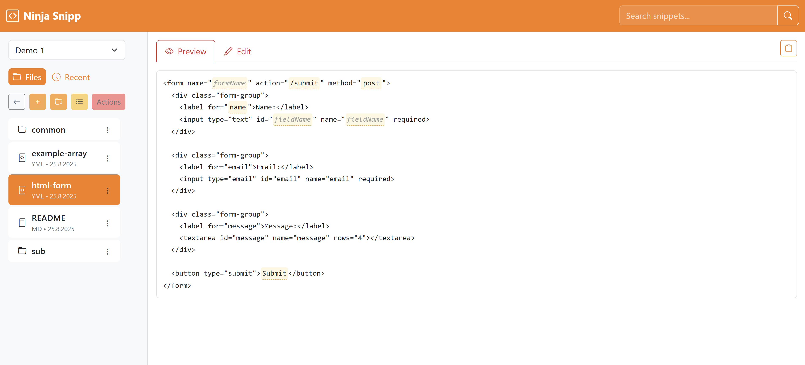

# NinjaSnipp

A snippet manager app that has some special features

- File system based, multiple source folders
- Nested includes
- "Soft links": Files and folders can be used multiple times

### File system include feature

- File: `11 INCLUDE error-handling`
- Folder: `11 INCLUDE common`
- current data folder only

### Placeholders

- `{{placholder}}`
- `{{placholder=default}}`
- `{{placholder=one|two|three}}`
  - first currently is default
- `{{include: "Snippet name"}}`

### Sample

LICENSE
----------------------------------------------------------

Copyright (C) Walter A. Jablonowski 2025, free under the [MIT license](LICENSE)

This app is build upon PHP and free software (see [credits](credits.md)).

[Privacy](https://walter-a-jablonowski.github.io/privacy.html) | [Legal](https://walter-a-jablonowski.github.io/imprint.html)
