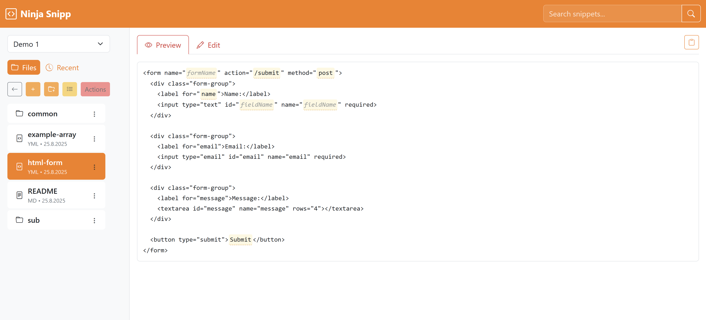

# NinjaSnipp

A snippet manager app that has some special features

- File system based, multiple source folders
- Nested includes
- "Soft links": Files and folders can be used multiple times

### File system include feature

Combined base folders: cmn plus detail (see settings)

- File: `11 INCLUDE error-handling`
- Folder: `11 INCLUDE common`
- current data folder only

### File format

version 2

```yml
id:           # snipp version
version:      # snipp file version
sc:
short:        # short desc
usage:        # full text or yml keys
  vars:
    myVar: explanation
  text:       # Main details
  secondary:  # Grey details
content:
```

### Placeholders

- `{{placholder}}`
- `{{placholder=default}}`
- `{{placholder=one|two|three}}`
  - first currently is default
- `{{include: "Snippet name"}}`
- Optional text:
  ```
  {{ MAYBE: SomeName }}
  Some optional text
  {{ END-MAYBE }}
  ```
- Trick for optional text: `{{optional=My optional text}}`

### Misc

- initially load data folder `index.php?data=Demo%202` (key from config)

### Sample




LICENSE
----------------------------------------------------------

Copyright (C) Walter A. Jablonowski 2025, free under the [MIT license](LICENSE)

This app is build upon PHP and free software (see [credits](credits.md)).

[Privacy](https://walter-a-jablonowski.github.io/privacy.html) | [Legal](https://walter-a-jablonowski.github.io/imprint.html)
